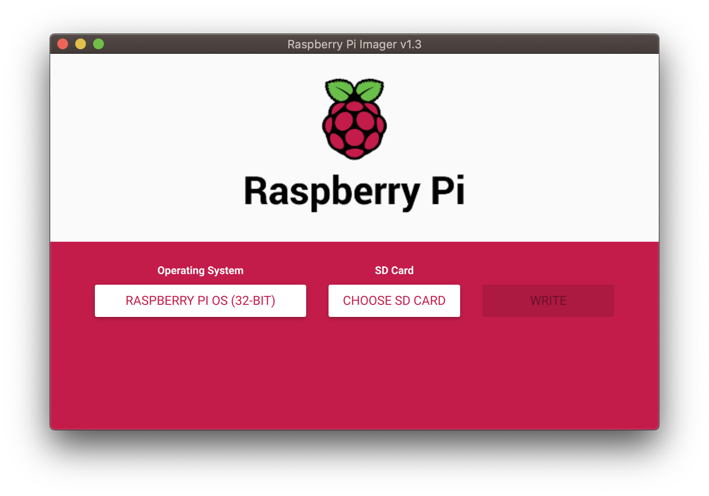

# Magic Mirror

Realization of my magic mirror.

## Initialize the Raspberry

### Raspberry Pi OS Installation

#### Prepare SD Card

[Download Raspberry Pi Imager for your OS](https://www.raspberrypi.org/downloads/)

Connect the SD Card to the laptop and launch Raspberry Pi Imager:



Install Raspberry PI OS on the  SD Card.

#### Test & finish configuration

Connect a keyboard andd a mouse and connect the Raspberry to a screen with an HDMI cable.

Follow the few installation steps to finish Raspberry OS configuration.

#### Fix the IP

You can fix the address IP of the raspberry on your local network to facilitate the management of your magic mirror. The procedure depends on your Internet box.

On the Raspberry, you can get the current network configuration including IP and MAC address using the command `ifconfig`.

#### Activate SSH

The SSH server is disabled by default on Raspberry for security concerns. I prefer activate it to manage my MagicMirror remotely, without having to take it off the wall.

Update the Rapberry configuration with the command:

```bash
sudo raspi-config
```

See [here](https://www.raspberrypi.org/documentation/remote-access/ssh/) for more details on the procedure.

Send your SSH key on the raspberry to connect without password:

```bash
ssh-copy-id -i [YOUR_SSH_PUB_KEY] pi@[IP_ADDRESS]
```

You can even create an alias on your computer to connect more easily, without havinig to remember the IP address of the Raspberry. Just add the following alias in your profile:

```bash
alias mirror="ssh pi@[IP_ADDRESS]"
```

### Install Magic Mirror

[Install](https://docs.magicmirror.builders/getting-started/installation.html)

### Install Jarvis

[Install](http://openjarvis.com/content/installation)